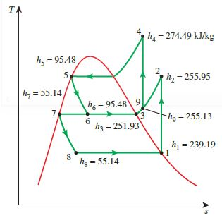

# SimVCCE

- [SimVCCE](#simvcce)
    - [Prerequisites：CoolProp, phyprops](#prerequisitescoolprop-phyprops)
  - [The Vapor-Compression Cycle Examples](#the-vapor-compression-cycle-examples)
    - [1 The Ideal Vapor-Compression Refrigeration Cycles](#1-the-ideal-vapor-compression-refrigeration-cycles)
    - [2 The Cascade Refrigeration Cycle](#2-the-cascade-refrigeration-cycle)
    - [3 Multistage Compression Refrigeration](#3-multistage-compression-refrigeration)
    - [4 Performance Analysis of VCR cycle under Variable Conditions](#4-performance-analysis-of-vcr-cycle-under-variable-conditions)

The SimVCCE is the vapor-compression refrigeration and heat pump cycle steady-state simulator for education.

The simulator is available in Python, C++ and Modelica

* branch: **B2022**`:  [Python : sequential-modular approach](./vccpython)

* branch **sm-port-conn**: Python, C++ and Modelica

We wish that SimVCCE may be a helpful vehicle for you to understand the object-oriented programming and improve programming skills

### Prerequisites：CoolProp, phyprops

```bash
python -m pip install coolprop
```

```bash
python -m pip install phyprops
```
## The Vapor-Compression Cycle Examples

Yunus A. Cengel, Michael A. Boles,Thermodynamics: An Engineering Approach, 8th Edition, McGraw-Hill.2015

### 1 The Ideal Vapor-Compression Refrigeration Cycles

* using the Python Module for the Cycle Flowsheet and Data

  * [./vccpython/vccapp.py](./vccpython/vccapp.py) 
  
* using JSON File of the Cycle Flowsheet and Data

   * [./vccpython/vccapp_json.appn](./vccpython/vccapp_json.app) 

EXAMPLE 11–1 The Ideal Vapor-Compression Refrigeration  Cycle

A refrigerator uses R134a as the working fluid and operates on an ideal vapor-compression refrigeration cycle between 0.14 and 0.8 MPa.

If the mass flow rate of the refrigerant is 0.05 kg/s, 

**Determine** 

* (a) the rate of heat removal from the refrigerated space and the power input to the compressor,
* (b) the rate of heat rejection to the environment, and 
* (c) the COP of the refrigerator.


### 2 The Cascade Refrigeration Cycle

* [./playground/demo_cascade.py](./playground/demo_cascade.py)

EXAMPLE 11–4 A Two-Stage Cascade Refrigeration Cycle,,Page625-626

Consider a two-stage cascade refrigeration system operating between the pressure limits of 0.8 and 0.14 MPa.

Each stage operates on an ideal vaporcompression refrigeration cycle with R134a as the working fluid. 

Heat rejection from the lower cycle to the upper cycle takes place in an adiabatic counterflow heat exchanger where both streams enter at about 0.32 MPa.

(In practice, the working fluid of the lower cycle is at a higher pressure and temperature in the heat exchanger for effective heat transfer.) 

If the mass flow rate of the refrigerant through the upper cycle is 0.05 kg/s, 

**Determine** 

* (a) the mass flow rate of the refrigerant through the lower cycle,
* (b) the rate of heat removal from the refrigerated space and the power input to the compressor, and 
* (c) the coefficient of performance of this cascade refrigerator


### 3 Multistage Compression Refrigeration 

* [./playground/demo_two_stage.py](./playground/demo_two_stage.py)

EXAMPLE 11–5 A Two-Stage Refrigeration Cycle with a Flash Chamber

Consider a two-stage compression refrigeration system operating between the pressure limits of 0.8 and 0.14 MPa. The working fluid is  R134a.
The refrigerant leaves the condenser as a saturated liquid and is throttled to a flash chamber operating at 0.32 MPa. 

Part of the refrigerant evaporates during this flashing process, and this vapor is mixed with the refrigerant leaving the low-pressure compressor. 

The mixture is then compressed to the condenser pressure by the high-pressure compressor. 

The liquid in the flash chamber is throttled to the evaporator pressure and cools the refrigerated space as it vaporizes in the evaporator. 

Assuming the refrigerant leaves the evaporator as a saturated vapor and both compressors are isentropic,

**Determine**

* (a) the fraction of the refrigerant that evaporates as it is throttled to the flash chamber,
* (b) the amount of heat removed from the refrigerated space and the compressor work per unit mass of refrigerant flowing through the condenser, and
* (c) the coefficient of performance.




### 4 Performance Analysis of VCR cycle under Variable Conditions

* [./playground/demo_var.py](./playground/demo_var.py)

The ideal vapor-compression refrigeration cycle of [Vapor-compression refrigeration simulation and tutorial](https://peer.asee.org/vapor-compression-refrigeration-simulation-and-tutorial.pdf)

* the evaporator pressure is maintained constant at 0.12MPa
* the mass flow rate of refrigerant is 1 kg/s.

**Variable conditions**

* **refrigerants**: R12,R134a,R22

* **condenser pressures**:0.4, 0.5, 0.6, 0.7, 0.8, 0.9,0.1, 1.4 MPa.

**Analysis**

Calculate the COP of the ideal vapor-compression refrigeration cycle 

* **Save** the results to the csv file

* **Plot** the COPs against the condenser pressure

