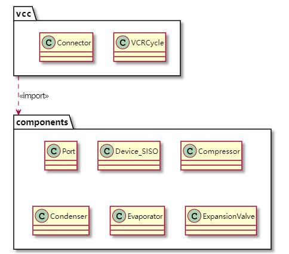

# PlantUML Class Diagrams

- [PlantUML Class Diagrams](#plantuml-class-diagrams)
  - [1 Class Compressor](#1-class-compressor)
  - [2 The Composition Relationship](#2-the-composition-relationship)
  - [3 The Aggregation Relationship](#3-the-aggregation-relationship)
  - [4 The Class-level Inheritance Relationship](#4-the-class-level-inheritance-relationship)
  - [5 Package](#5-package)

## 1 Class Compressor

When you define methods or fields, you can use **characters** to define the **visibility** of the corresponding item:

| Character  | Visibility  |
| ---------- |:-----------:| 
| -          | private     |
| +          | public      | 
  
You can define static(class)  methods or fields using the `{static}`

```puml
class Device_SISO {
 + {static} devtype: str
 + {static} energy: str
 + name: str
 + iPort: Port
 + oPort: Port
 + {static} Device_SISO(dictDev:dict)
 + state()
 + mass_balance()
 + balance()
 + __str()__:str
}
note left of Device_SISO::devtype
  the type of device: **class**
end note
note left of Device_SISO::energy
  the energy type of device: **class**
end note
note left of Device_SISO::name
  the name of device
end note
note left of Device_SISO::iPort
  inlet port
end note
note left of Device_SISO::oPort
  outlet port
end note
note left of Device_SISO::Device_SISO(dictDev:dict)
  **dict** {"name": "*",
            "devtype": "*",
            "iPort*": {},
            "oPort*": {}}
end note
note right of Device_SISO::state
  get port state by thremal process
end note
note right of Device_SISO::mass_balance()
  mass balance
end note
note right of Device_SISO::balance
  energy and mass balancing
end note
note right of Device_SISO::__str()__
  the string of the instance
end note
```


## 2 The Composition Relationship

The Composition Relationship is  defined using the following symbol:

```
*-- 
```
For cardinality, you can use double-quotes `" "` on each side of the relation.

It is possible to add a label on the relation, using `:`, followed by the text of the label.

The Composition relation of Compressor and Port's instance

```puml
class Compressor{
  + iPort : Port
  + oPort : Port
}
Compressor "1" *-- "2" Port 
```


## 3 The Aggregation Relationship

The Aggregation Relationship is  defined using the following symbol:

```
o-- 
```

The Aggregation and Compositionrelation of VCR Cycle and it's components 

```puml
vcc.VCRCycle "1" *-[#blue]- "1" vcc.Connector 
vcc.VCRCycle "1" o-- "1" components.Compressor 
vcc.VCRCycle "1" o-- "1" components.Condenser
vcc.VCRCycle "1" o-- "1" components.Evaporator
vcc.VCRCycle "1" o-- "1" components.ExpansionValve
```


## 4 The Class-level Inheritance Relationship


The class Inheritance Relationship  is  defined using the following symbol:

```
<|--
```

The Inheritance Relationship of components and Device_SISO

```puml
Compressor <|-- Device_SISO  
Condenser <|-- Device_SISO  
Evaporator <|-- Device_SISO  
ExpansionValve <|-- Device_SISO  
```


## 5 Package
```puml
@startuml
package components {
  class Port
  class Device_SISO
  class Compressor
  class Condenser
  class Evaporator
  class ExpansionValve
}
package vcc {
  class VCRCycle   
  class Connector 

}
vcc ..> components : <<import>>
@enduml
```



