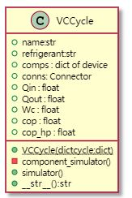
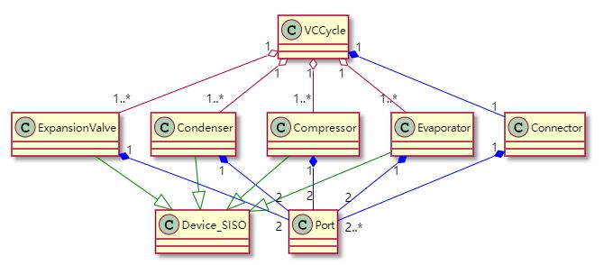

# Class Diagrams of VCCE in PlantUML

- [Class Diagrams of VCCE in PlantUML](#class-diagrams-of-vcce-in-plantuml)
  - [Class Method or Field](#class-method-or-field)
    - [Visibility](#visibility)
    - [Scope](#scope)
  - [Instance-level Relationships](#instance-level-relationships)
    - [Composition](#composition)
    - [Aggregation](#aggregation)
  - [Class-level Inheritance Relationship](#class-level-inheritance-relationship)
  - [Class and Instance Relations](#class-and-instance-relations)
  - [Package](#package)

## Class Method or Field

### Visibility

When you define methods or fields, you can use **characters** to define the **visibility** of the corresponding item:

| Visibility | UML Character |Icon for field in PlantUML       |Icon for method in PlantUML|
|:---------:|:--------: |:------------------------------------: |:------------------------: |
| private   |  -        |  <font color="red">red □ </font>      |   <font color="red">red ■  </font>     |
| public    |  +       |  <font color="green">green ○ </font>   |  <font color="green">green ●  </font>    |
  

```puml
class VCCycle {
       + name:str 
       + refrigerant:str
       + comps : dict of device 
       + conns: Connector
       + Qin : float 
       + Qout : float 
       + Wc : float
       + cop : float
       + cop_hp : float
       + {static} VCCycle(dictcycle:dict)
       - component_simulator() 
       + simulator() 
       + __str__():str
 }
```



### Scope

The UML specifies two types of scope for members: `instance and class`

You can define **class**  methods or fields using the **{static}**

```puml
class Device_SISO {
 + {static} devtype: str
 + {static} energy: str
 + name: str
 + iPort: Port
 + oPort: Port
 + {static} Device_SISO(dictDev:dict)
 + state()
 + mass_balance()
 + balance()
 + __str()__:str
}
note left of Device_SISO::devtype
  the type of device: **class**
end note
note left of Device_SISO::energy
  the energy type of device: **class**
end note
note left of Device_SISO::name
  the name of device
end note
note left of Device_SISO::iPort
  inlet port
end note
note left of Device_SISO::oPort
  outlet port
end note
note left of Device_SISO::Device_SISO(dictDev:dict)
   {"name": "*",
    "devtype": "*",
    "iPort": {},
    "oPort": {}}
end note
note right of Device_SISO::state
  get port state by thremal process
end note
note right of Device_SISO::mass_balance()
  mass balance
end note
note right of Device_SISO::balance
  energy and mass balancing
end note
note right of Device_SISO::__str()__
  the string of the instance
end note
```


## Instance-level Relationships

### Composition

The Composition Relationship is  defined using the following symbol:

```
*-- 
```

For cardinality, you can use double-quotes `" "` on each side of the relation.

It is possible to add a label on the relation, using `:`, followed by the text of the label.

The Composition relation of Compressor and Port's instance

```puml
class Compressor {
 + iPort: Port
 + oPort: Port
}
class Condenser {
 + iPort: Port
 + oPort: Port
}
class Evaporator {
 + iPort: Port
 + oPort: Port
}
class ExpansionValve {
 + iPort: Port
 + oPort: Port
}
Compressor "1" *-- "2" Port
ExpansionValve "1" *-- "2" Port
Evaporator "1" *-- "2" Port
Condenser "1" *-- "2" Port

```


### Aggregation

The Aggregation Relationship is  defined using the following symbol:

```
o-- 
```

The Aggregation and Compositionrelation of VCR Cycle and it's components 

```puml
VCRCycle "1" *-[#blue]- "1" Connector 
VCRCycle "1" o-- "1" Compressor 
VCRCycle "1" o-- "1" Condenser
VCRCycle "1" o-- "1" Evaporator
VCRCycle "1" o-- "1" ExpansionValve
```


## Class-level Inheritance Relationship

The class Inheritance Relationship  is  defined using the following symbol:

```
<|--
```

The Inheritance Relationship of Device_SISO and components  

```puml
Device_SISO  <|--Compressor  
Device_SISO  <|-- Condenser  
Device_SISO <|-- Evaporator   
Device_SISO  <|-- ExpansionValve  
```


## Class and Instance Relations 

```puml
VCCycle "1" *-[#blue]- "1" Connector 
VCCycle "1" o-- "1..*" Compressor 
VCCycle "1" o-- "1..*" Condenser
VCCycle "1" o-- "1..*" ExpansionValve
VCCycle "1" o-- "1..*" Evaporator

Connector "1" *-[#blue]- "2..*" Port
Compressor "1" *-[#blue]- "2" Port
Condenser "1" *-[#blue]- "2" Port
ExpansionValve "1" *-[#blue]- "2" Port
Evaporator "1" *-[#blue]- "2" Port

Device_SISO <|-up[#green]- Compressor   
Device_SISO <|-up[#green]- Condenser    
Device_SISO <|-up[#green]-ExpansionValve    
Device_SISO <|-up[#green]- Evaporator  
```


## Package

```puml
@startuml
package components {
  class Port
  class Device_SISO
  class Compressor
  class Condenser
  class Evaporator
  class ExpansionValve
}
package vcc {
  class VCRCycle   
  class Connector 

}
vcc ..> components : <<import>>
@enduml
```


