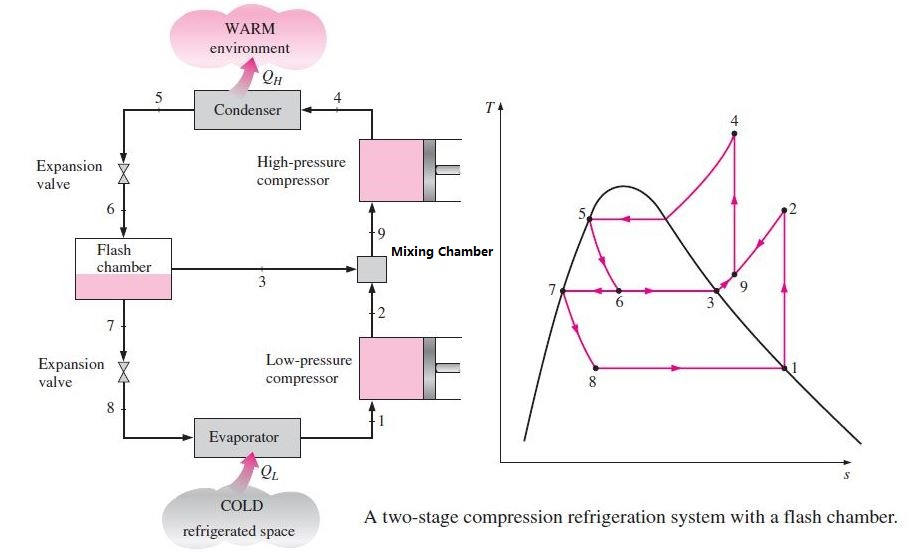

# Playground 

- [1 Cascade Refrigeration Cycle](#1-cascade-refrigeration-cycle)
- [2 Multistage Compression Refrigeration](#2-multistage-compression-refrigeration)
- [3 Performance Analysis of VCR cycle under Variable Conditions](#3-performance-analysis-of-vcr-cycle-under-variable-conditions)

## 1 Cascade Refrigeration Cycle

>Majid Bahrami. ENSC461(S11)：Energy Conversion,Simon Fraser University,Canada

The Cascade system  have 2 (or more) refrigeration cycles operating in series.

Th Cascade cycle is used where a very wide range of temperature between `TL` and `TH `is required. 

As shown in the Fig, the `condenser` for the `low` temperature refrigerator is used as the `evaporator` for the `high` temperature refrigerator

Consider a two-stage cascade refrigeration system operating between pressure limits of `0.8` and `0.14` MPa.

Each stage operates on an ideal vapor-compression refrigeration cycle
with refrigerant `R-134a` as working fluid. 

`Heat rejection` from the `lower` cycle to the `upper` cycle takes place in an adiabatic counter flow heat exchanger where both streams enter at
about `0.32` MPa.

If the mass flow rate of the refrigerant through the `upper` cycle is `0.05`
kg/s,

**Determine**

* a) the mass flow rate of the refrigerant through the lower cycle
* b) the rate of heat removal from the refrigerated space
* c) the power input to the compressor
* d) COP

## 2 Multistage Compression Refrigeration 

>Yunus A. Cengel, Michael A. Boles,Thermodynamics: An Engineering Approach, Seventh Edition, McGraw-Hill, 2011.

Consider a two-stage compression refrigeration system 

The system is operating between  pressure limits of 1.4 and 0.1 MPa.

The working fluid is R1344a. 

The refrigerant leaves the condenser as a saturated liquid and is throttled  a flash chamber operating at 0.6 MPa. Part of the refrigerant evaporates during this flashing process, and this vapor is mixed with the refrigerant leaving the low-pressure compressor. 

The mixture is then compressed to the condenser pressure by the high-pressure compressor. The liquid in the flash chamber is throttled to the evaporator pressure and cools the refrigerated space as it vaporizes in the evaporator. 

Assuming the refrigerant leaves the evaporator as a saturated vapor and both compressors are isentropic, 

determine
* (a) the fraction of the refrigerant that evaporates as it is throttled to the flash chamber, 
* (b) the amount of heat removed from the refrigerated space and the compressor work per unit mass of refrigerant flowing through
the condense
* (c) the coefficient of performance.

## 3 Performance Analysis of VCR cycle under Variable Conditions

* [ivcr_var.json](./jsonmodel/ivcr_var.json) 

* demo_var.py

The ideal vapor-compression refrigeration cycle of [Vapor-compression refrigeration simulation and tutorial](https://peer.asee.org/vapor-compression-refrigeration-simulation-and-tutorial.pdf)

* the evaporator pressure is maintained constant at 0.12MPa
* the mass flow rate of refrigerant is 1 kg/s.

**Variable conditions**

* **refrigerants**: R12,R134a,R22

* **condenser pressures**:0.4, 0.5, 0.6, 0.7, 0.8, 0.9,0.1, 1.4 MPa.

**Analysis**

Calculate the COP of the ideal vapor-compression refrigeration cycle 

* **Save** the results to the csv file

* **Plot** the COPs against the condenser pressure

